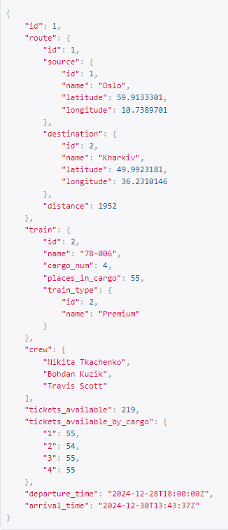
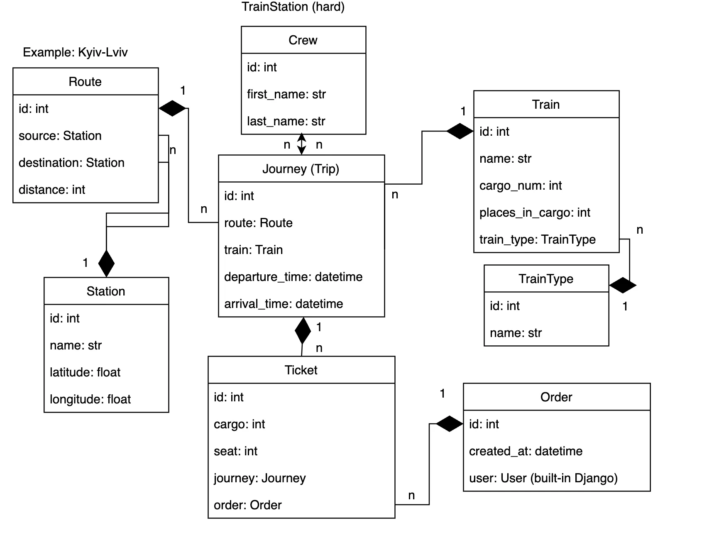

# Train Management System

## Project Overview
The **Train Management System** is a Django-based backend project designed to manage railway operations, including routes, trains, journeys, ticket bookings, and orders. The system provides RESTful APIs for interacting with railway data, ensuring efficient and streamlined operations.

## Key Features
- **User Authentication:** JWT-based authentication for secure access.
- **Train Management:** Create, update, and monitor train details.
- **Route Management:** Manage train routes, calculate distances.
- **Journey Management:** Schedule journeys, assign crews, and allocate tickets.
- **Ticket Booking:** Reserve seats in specific cargos.
- **Ticket Analysing:** Counting available seats on the train / in each carriage.
- **Order Management:** Track user bookings and manage payments.
- **Permissions:** Different access levels for administrators and regular users.
- **Filtering:** Filter journeys by departure, arrival date and time, by routes.
- **Throttling:** Limited number of requests to prevent attacks.
- **Media files:** Uploading images for the crew.

## Tech Stack
- **Backend:** Django, Django REST Framework (DRF)
- **Authentication:** Simple JWT
- **Database:** SQLite (or PostgreSQL for production)
- **Geolocation:** Geopy
- **Testing:** Django Test Framework

## Installation

1. Clone the repository:
```bash
$ git clone https://github.com/pohgen/train-station-service.git
$ cd train-station-service
```
2. Create and activate a virtual environment:
```bash
$ python -m venv venv
$ source venv/bin/activate  # On Windows: venv\Scripts\activate
```
3. Configure environment variables:

_Create a `.env` file with the following variables:_
```
POSTGRES_USER=your_user
POSTGRES_PASSWORD=your_password
POSTGRES_DB=your_db
POSTGRES_HOST=your_db_host
POSTGRES_PORT=your_db_port
PGDATA=your_pgdata
```
4. Build and up docker:
```bash
$ docker-compose up --build
```
5. Create superuser:
```shell
# Locally:
python manage.py createsuperuser

# Using Docker:
docker ps # find your Django image and copy its ID
docker exec -it <id> sh
python manage.py createsuperuser
```

6. Go to http://127.0.0.1:8000/ or http://localhost:8000/


7. Create new user to discover the API:

* Create a new user via /api/user/register/ or use a previously created superuser
* Get access token via /api/user/token/ (it will be active for 10 minutes)
## API Endpoints

### User Endpoints:
- **User Authentication:** `/api/user/token/`
- **Token Refreshing:** `/api/user/token/refresh`
- **Token Verify:** `/api/user/token/verify`
- **User Register:** `/api/user/register/`
- **User Managing:** `/api/user/me/`

### Train Station Endpoints:
- **Crew Management:** `/api/train-station/crew/`
- **Station Management:** `/api/train-station/stations/`
- **Train Type Management:** `/api/train-station/train-types/`
- **Train Management:** `/api/train-station/trains/`
- **Route Management:** `/api/train-station/routes/`
- **Journey Management:** `/api/train-station/journeys/`
- **Order Management:** `/api/train-station/orders/`

## Testing
Run tests using Django's test suite:
```bash
$ python manage.py test
```

## Permissions
- **Admin:** Full access to all resources.
- **Authenticated User:** Limited access to order and booking functionalities.
- **Anonymous User:** Register page.

## Demo (Journey Detail)


## Models schema


## Contact
For any questions, reach out via [sanyok.it@gmail.com](mailto:sanyok.it@gmail.com).

**If the implementation is hard to explain, it's a bad idea. Good luck! 🚂✨**

